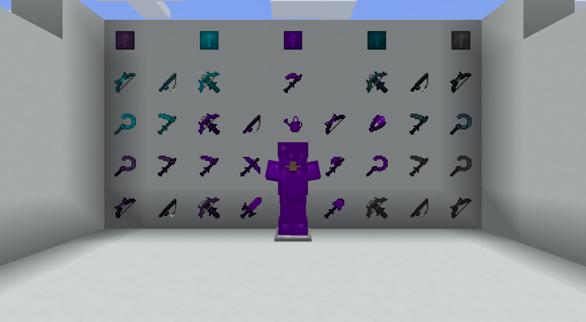

This mod is a small addon for Mystical Agriculture, Mystical Agradditions and Mystical Extended Tier, aimed at completing the tool and armor lineup for the higher essence tiers.

Features

• **New Armor Sets**

Adds missing armor pieces for the higher-tier essences, allowing full progression beyond existing sets.

• **New Tools & Weapons**

Introduces several tools and utility items that were not included in the base mods, such as:

- Scythe
- Bow
- Sickle
- Shears
- Fishing Rod
- Machine Upgrade

Each item follows the balance, style, and progression of the Mystical Agriculture ecosystem.

• **Seamless Integration**

All items use the correct essences, crafting themes, textures, and upgrade flow to match Mystical Agriculture and Mystical Agradditions.

• **Lightweight Addon**

This addon does not change progression, crops, or tiers—its only purpose is to complete the missing equipment options for players who want a more consistent set of tools and armor.

